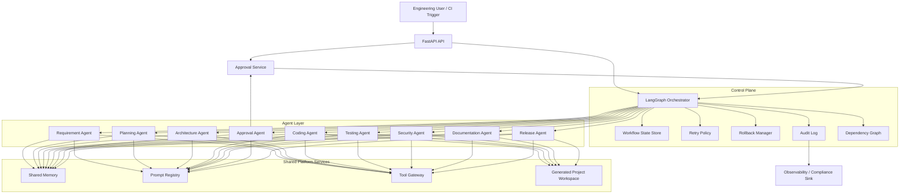
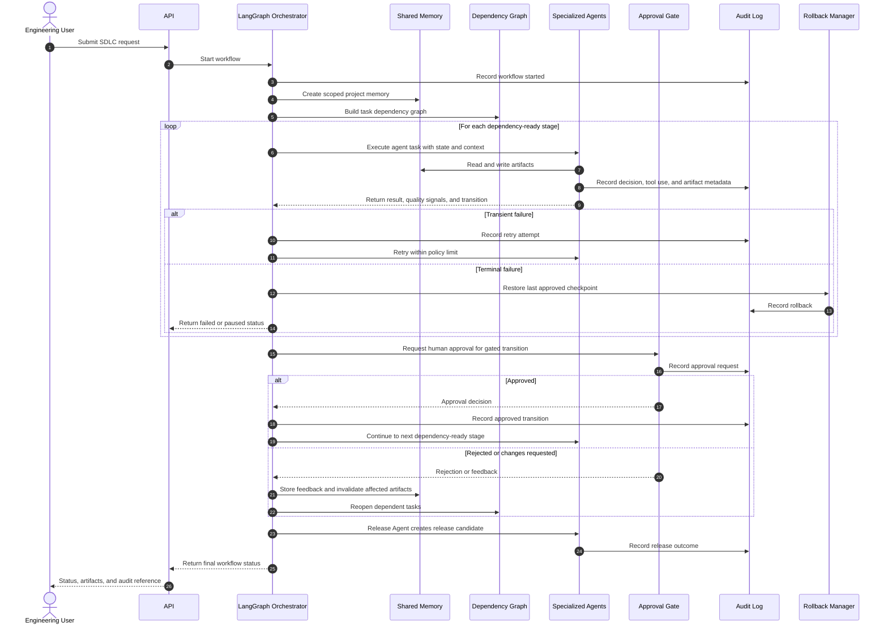
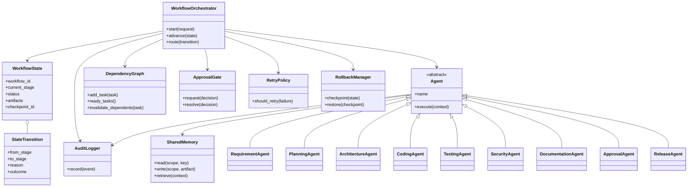

# Agentic SDLC Platform Architecture

## 1. Component Diagram

## 2. Sequence Diagram

## 3. Class Diagram

## 4. Folder Mapping

| Folder | Architecture responsibility |
| --- | --- |
| `src/agentic_software_engineer/domain/` | Core workflow concepts: artifacts, policies, approvals, state transitions, and dependency rules. |
| `src/agentic_software_engineer/application/use_cases/` | Application-level SDLC commands such as initiating a workflow, approving a gate, retrying, and releasing. |
| `src/agentic_software_engineer/application/ports/` | Interfaces for persistence, LLMs, source control, CI/CD, notifications, and human approval. |
| `src/agentic_software_engineer/agents/` | The nine specialist agent definitions and their input/output contracts. |
| `src/agentic_software_engineer/orchestrator/` | LangGraph graph, routing rules, workflow state, checkpoints, retries, and rollback coordination. |
| `src/agentic_software_engineer/memory/` | Shared project memory, artifact retrieval, session context, and retention policy adapters. |
| `src/agentic_software_engineer/prompts/` | Governed, versioned prompts grouped by specialist agent and task. |
| `src/agentic_software_engineer/tools/` | Controlled interfaces to repositories, files, test runners, scanners, CI/CD, and ticketing systems. |
| `src/agentic_software_engineer/infrastructure/openai/` | OpenAI SDK adapters. |
| `src/agentic_software_engineer/infrastructure/langgraph/` | LangGraph runtime and persistence adapters. |
| `src/agentic_software_engineer/infrastructure/di/` | Composition root and dependency-injection registrations. |
| `src/agentic_software_engineer/infrastructure/config/` | Environment-specific settings, secrets references, and policy configuration. |
| `src/agentic_software_engineer/api/` | FastAPI endpoints for workflow execution, status, approvals, artifacts, and audit queries. |
| `src/agentic_software_engineer/ui/` | Future approval and workflow-observability interface. |
| `generated_projects/` | Per-project generated source, isolated from platform source and partitioned by workflow/project identity. |
| `tests/` | Unit, integration, and end-to-end verification of agents, orchestration, gates, and recovery behavior. |

## 5. Responsibilities

| Component | Primary responsibility |
| --- | --- |
| Requirement Agent | Transform requests into testable requirements, constraints, acceptance criteria, and unresolved questions. |
| Planning Agent | Produce executable work breakdowns, estimates, milestones, and task dependencies. |
| Architecture Agent | Define technical design, boundaries, interfaces, data flows, and non-functional requirements. |
| Coding Agent | Produce scoped changes from approved plans and architecture decisions. |
| Testing Agent | Generate and run appropriate verification plans; report coverage and failures. |
| Security Agent | Apply secure-design review, dependency and code scanning, and policy checks. |
| Documentation Agent | Maintain technical, operational, API, and user-facing documentation artifacts. |
| Approval Agent | Package decision-ready evidence, request human approval, and record the immutable decision. |
| Release Agent | Create release candidates, coordinate deployment controls, and publish release evidence. |
| LangGraph Orchestrator | Enforce valid state transitions, graph routing, parallelism constraints, retries, checkpoints, and recovery. |
| Shared Memory | Provide scoped, attributed, versioned context and artifacts across agents and workflow stages. |
| Dependency Graph | Ensure tasks run only when prerequisites are complete; reopen downstream work when inputs change. |
| Audit Log | Record every transition, decision, prompt version, tool invocation, artifact hash, and human action. |

## 6. Design Principles

1. **Human authority at material risk boundaries.** Require approval before architecture commitment, privileged changes, production release, and policy exceptions.
2. **Explicit state machines.** Model every stage and terminal condition as a validated transition; never infer workflow progress from free-form text.
3. **Artifact-first collaboration.** Agents exchange versioned, attributable artifacts rather than relying on opaque conversation history.
4. **Dependency-aware execution.** Use a directed acyclic dependency graph to sequence work, enable safe parallelism, and invalidate downstream outputs after change.
5. **Bounded autonomy.** Constrain each agent by role, tools, permissions, budget, retry policy, and approved scope.
6. **Recoverable execution.** Checkpoint before material transitions, classify failures, retry only transient failures, and roll back to approved checkpoints.
7. **Auditability by default.** Persist sufficient immutable evidence to reconstruct who or what made every consequential decision.
8. **Clean Architecture.** Keep domain policies independent from FastAPI, LangGraph, OpenAI, persistence, and provider-specific tooling.
9. **Least privilege and zero trust.** Grant agents narrowly scoped credentials and validate all tool inputs, outputs, and generated changes.
10. **Quality gates before release.** Prevent release progression until testing, security, documentation, and required human approvals have succeeded.
